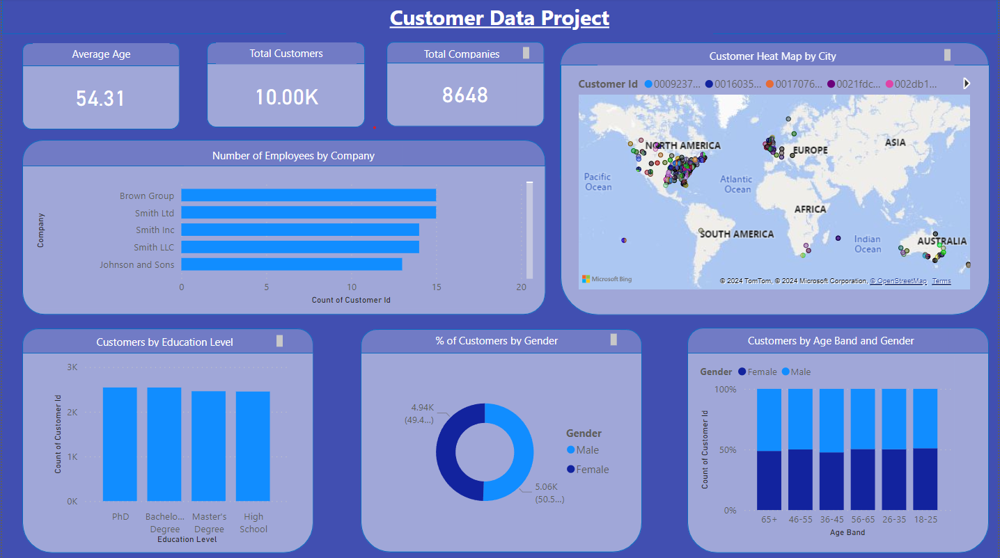

SQL-PowerBi-Customer-Data-Project
In this example, I generated a sample CSV file that imitates real-world values for customers.
The CSV file includes the following columns:

Customer Id
First Name
Last Name
Email
Phone
Birthday
Age
Age Band
Gender
Occupation
Education Level
Company
Country
City
Address
Postal Code
The data is then manipulated and observed using MySQL and visualized in Power BI.

